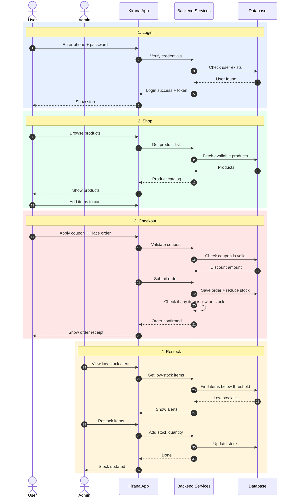

# Kirana Store — Sequence Diagram

How a customer buys groceries and how the admin restocks items.

```mermaid
sequenceDiagram
    autonumber

    actor User
    actor Admin
    participant App as Kirana App
    participant Backend as Backend Services
    participant DB as Database

    rect rgb(230, 240, 255)
        Note over User,DB: 1. Login
        User->>App: Enter phone + password
        App->>Backend: Verify credentials
        Backend->>DB: Check user exists
        DB-->>Backend: User found
        Backend-->>App: Login success + token
        App-->>User: Show store
    end

    rect rgb(230, 255, 240)
        Note over User,DB: 2. Shop
        User->>App: Browse products
        App->>Backend: Get product list
        Backend->>DB: Fetch available products
        DB-->>Backend: Products
        Backend-->>App: Product catalog
        App-->>User: Show products
        User->>App: Add items to cart
    end

    rect rgb(255, 230, 230)
        Note over User,DB: 3. Checkout
        User->>App: Apply coupon + Place order
        App->>Backend: Validate coupon
        Backend->>DB: Check coupon is valid
        DB-->>Backend: Discount amount
        App->>Backend: Submit order
        Backend->>DB: Save order + reduce stock
        Backend->>Backend: Check if any item is low on stock
        Backend-->>App: Order confirmed
        App-->>User: Show order receipt
    end

    rect rgb(255, 245, 220)
        Note over Admin,DB: 4. Restock
        Admin->>App: View low-stock alerts
        App->>Backend: Get low-stock items
        Backend->>DB: Find items below threshold
        DB-->>Backend: Low-stock list
        Backend-->>App: Show alerts
        Admin->>App: Restock items
        App->>Backend: Add stock quantity
        Backend->>DB: Update stock
        Backend-->>App: Done
        App-->>Admin: Stock updated
    end
```
